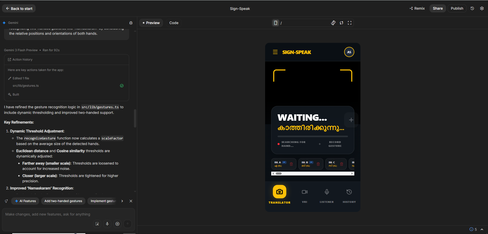
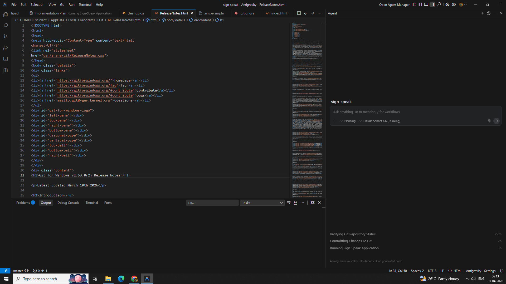
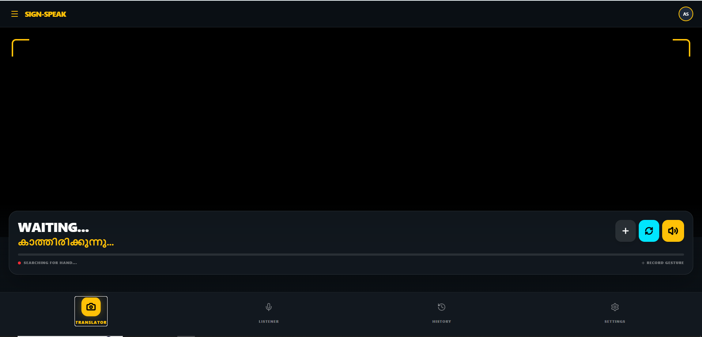
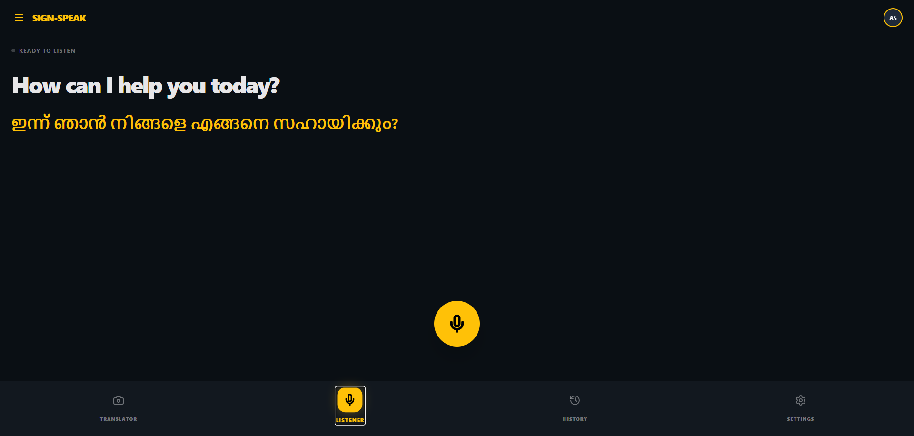
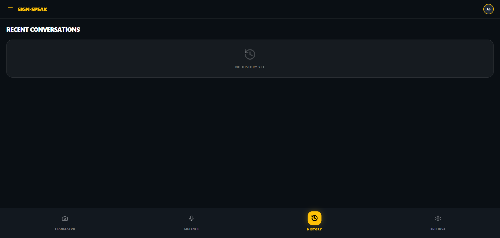
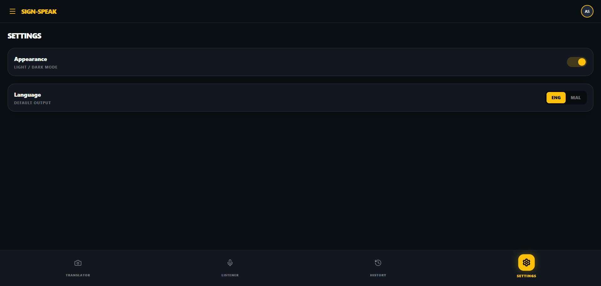

# Sign-Speak – Real-Time Sign Language to Speech Translator

## 📌 Problem Statement

Communication between hearing-impaired individuals and people who do not know sign language is often limited in daily scenarios like classrooms, hospitals, markets, and public services. Most solutions either require expensive hardware, large datasets, or cloud dependency — limiting accessibility and real-time usability.

Sign-Speak solves this by running sign detection and language generation **in the browser** using lightweight AI tools, making it fast, affordable, and practical.

---

## 💡 Project Description

**Sign-Speak** is a **real-time web application** that:

- Captures hand gestures with a webcam  
- Detects hand landmarks using Google’s MediaPipe  
- Matches gestures from a pre-built dictionary  
- Generates natural sentences using Google Gemini  
- Outputs text + speech instantly

### How It Works

1. User enables webcam.  
2. Hand landmarks are detected at ~30 FPS using MediaPipe Hands.  
3. Gesture recognition logic finds the closest matching sign.  
4. Recognized words are sent to Gemini API to form meaningful sentences.  
5. Output text is displayed and spoken via Web Speech API.

---

## ⭐ Key Features

- ⚡️ **Real-Time Gesture Recognition**  
- 🤖 **AI-Assisted Sentence Generation (Gemini)**  
- 🌐 **Offline-Capable Core Logic**  
- 🔊 **Text + Speech Output**  
- 🌍 **Supports English & Malayalam**  
- 📱 **Mobile-Friendly UI**

---

## 🧠 Google AI Usage

### 🛠 Tools / Models Used

- **Google Gemini API** — for natural language sentence generation  
- **MediaPipe Hands (Google)** — for real-time 21-point hand tracking  
- **Web Speech API** — for TTS & optional speech recognition

### 🔍 How Google AI Was Used

**MediaPipe Hands**  
- Extracts high-quality landmark coordinates from webcam feed.  
- Runs fully in browser for low latency.

**Gemini API**  
- Converts detected words into smooth, contextual sentences.  
- Example: Input → `I HUNGRY` → Output → `I am hungry`

**Web Speech API**  
- Converts the final sentence to audible speech.

---

## 📁 Proof of Google AI Usage

|  |  |

---

## 📸 Screenshots

| Gesture Tracking | Translation UI |
|-----------------|----------------|
|  |  |
|  |  |

---

## ▶ Demo Video

👉 **Watch Demo:** `https://drive.google.com/file/d/1NMuuSyPmX4YPL-N-ZhthNyipbF7kDsuV/view?usp=drive_link`

---

## 🚀 Installation Steps

```bash
# Clone
git clone https://github.com/anjana2451/sign-speak0

# Go inside
cd sign-speak0

# Install dependencies
npm install

# Run project
npm start
